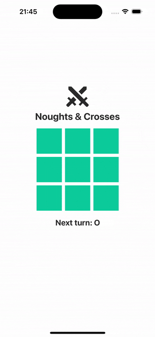

# Noughts and Crosses

Noughts and Crosses is a mobile and web application developed using Expo. This classic game, also known as Tic-Tac-Toe, allows players to engage in a simple yet fun game of trying to get three of their marks in a row.

## Requirements

Before installing and running the project, ensure you have the following tools installed:

- Node.js (latest LTS version)
- Git (for cloning the repository)

For running the app on a mobile device, you will also need:

- iOS: Latest version of Xcode and iOS Simulator
- Android: Latest version of Android Studio and Android Emulator

## Installation

1. Clone the repository:

```bash
git clone https://github.com/fiznool/noughts-and-crosses.git
cd noughts-and-crosses
```
2. Install the dependencies: `npm install`

## Running the App

### iOS

To run the app on an iOS Simulator:

1. Start the Metro Bundler: `npm start`
2. Press 'i' in the terminal to open the iOS Simulator.

### Android

To run the app on an Android Emulator:

1. Start the Metro Bundler: `npm start`
2. Press 'a' in the terminal to open the Android emulator.

### Web

To run the app in a web browser:

1. Start the Metro Bundler: `npm start`
2. Press 'w' in the terminal to open in a web browser.

## Tests

Tests can be run using `npm test`.

## Screenshots



## License

[MIT License](LICENSE)

## Contact

For any queries or suggestions, feel free to reach out to me via email.
